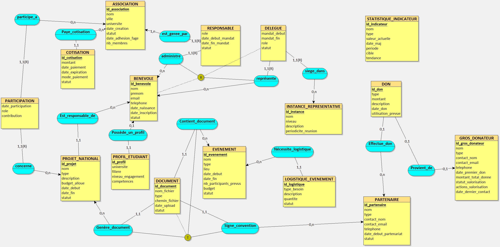

# Sae-web-refont

Dans le cadre de notre deuxième année de BUT informatique nous allons réaliser la refonte du site fage.org.

Ce projet sera réalisé par l'équipe :

Doucouré Bassirou, Déna Jean-François, Rezzouk Badreddine, Rahou Wallid

NB : En temps normal, le .env ne serait pas inclus dans le git, il est là uniquement pour montrer son existence

---
# Base de données

La base de données existe au format MySQL, elle est composée de 16 tables interconnectées

###### Figure A : MCD de la base de données

## MLD de la base de données

>ASSOCIATION = (id_association INT, nom VARCHAR(50), ville VARCHAR(50), universite VARCHAR(50), date_creation DATE, statut VARCHAR(50), date_adhesion_fage DATE, nb_membres INT); 
BENEVOLE = (id_benevole INT, nom VARCHAR(50), prenom VARCHAR(50), email VARCHAR(50), telephone VARCHAR(50), date_naissance DATE, date_inscription DATE, statut VARCHAR(50)); 
PROFIL_ETUDIANT = (id_profil INT, universite VARCHAR(50), filiere VARCHAR(50), niveau_engagement VARCHAR(50), competences VARCHAR(50), #id_benevole); 
COTISATION = (id_cotisation INT, montant DECIMAL(15,2), date_paiement DATE, date_expiration DATE, mode_paiement VARCHAR(50), statut VARCHAR(50), #id_association); 
RESPONSABLE = (#id_association, #id_benevole, role VARCHAR(50), date_debut_mandat DATE, date_fin_mandat DATE, statut VARCHAR(50)); 
PROJET_NATIONAL = (id_projet INT, nom VARCHAR(50), type VARCHAR(50), description VARCHAR(50), budget_alloue DECIMAL(15,2), date_debut DATE, date_fin DATE, statut VARCHAR(50), #id_benevole); 
PARTICIPATION = (#id_association, #id_projet, date_participation DATE, role VARCHAR(50), contribution VARCHAR(50)); 
STATISTIQUE_INDICATEUR = (id_indicateur INT, nom VARCHAR(50), type VARCHAR(50), valeur_actuelle DECIMAL(15,2), date_maj DATE, periode VARCHAR(50), cible DECIMAL(15,2), tendance VARCHAR(50)); 
GROS_DONATEUR = (id_gros_donateur INT, nom VARCHAR(50), type VARCHAR(50), contact_nom VARCHAR(50), contact_email VARCHAR(50), telephone VARCHAR(50), date_premier_don DATE, montant_total_donne DECIMAL(15,2), statut_valorisation VARCHAR(50), actions_valorisation VARCHAR(50), date_dernier_contact DATE); 
PARTENAIRE = (id_partenaire INT, nom VARCHAR(50), type VARCHAR(50), contact_nom VARCHAR(50), contact_email VARCHAR(50), telephone VARCHAR(50), date_debut_partenariat DATE, statut VARCHAR(50)); 
INSTANCE_REPRESENTATIVE = (id_instance INT, nom VARCHAR(50), niveau VARCHAR(50), description VARCHAR(50), periodicite_reunion VARCHAR(50)); 
EVENEMENT = (id_evenement INT, nom VARCHAR(50), type VARCHAR(50), lieu VARCHAR(50), date_debut DATE, date_fin DATE, nb_participants_prevus INT, budget DECIMAL(15,2), statut VARCHAR(50)); 
LOGISTIQUE_EVENEMENT = (id_logistique INT, type_besoin VARCHAR(50), description VARCHAR(50), quantite INT, statut VARCHAR(50), #id_evenement); 
DELEGUE = (#id_benevole, #id_instance, mandat_debut DATE, mandat_fin DATE, role VARCHAR(50), statut VARCHAR(50)); 
DON = (id_don INT, type VARCHAR(50), montant DECIMAL(15,2), description VARCHAR(50), date_don DATE, utilisation_prevue VARCHAR(50), #id_gros_donateur*, #id_partenaire*); 
DOCUMENT = (id_document INT, nom_fichier VARCHAR(50), type VARCHAR(50), chemin_fichier VARCHAR(50), date_upload DATE, statut VARCHAR(50), #id_partenaire, #id_projet, #id_evenement); 

---
# Site web : partie "front"

La partie "front", ou partie publique du site, est constituée de plusieurs pages HTML permettant à l'utilisateur de s'informer sur l'association FAGE.

---
# Site web : partie "back"

La partie "back" englobe le dashboard accessible par le/les administrateur(s) de l'association. plusieurs sections sont disponibles afin de séparer la lecture des données et ne pas noyer le consultant dans les informations tel un
capharnaüm. 

Il inclus également une page de login, si un acteur essaie d'accéder au dashboard sans s'authentifier, il est automatiquement redirigé vers la page de login.

Lorsque l'administrateur est connecté, la page par défaut est "section_dashboard", permettant de voir simplement quelques informations globales.

